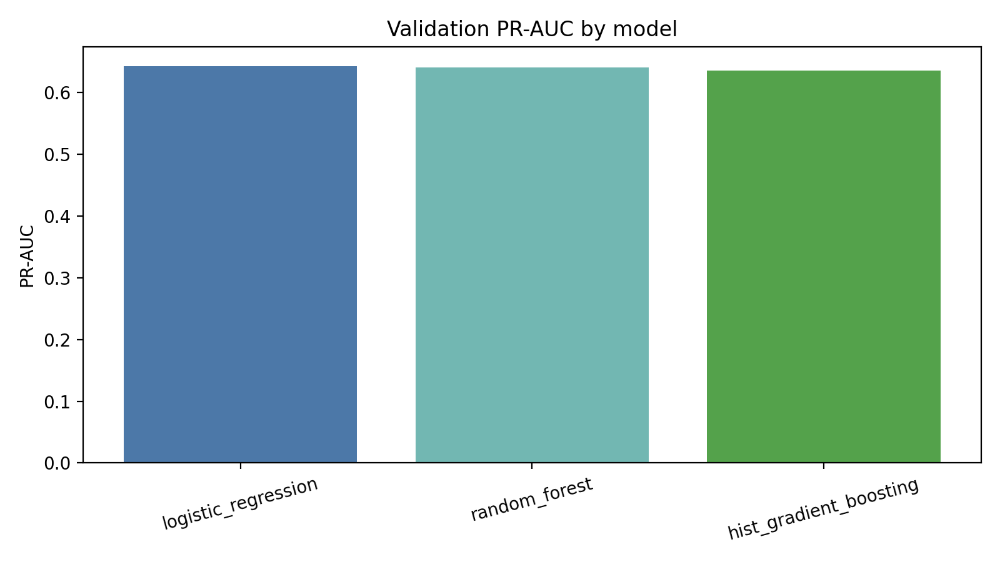
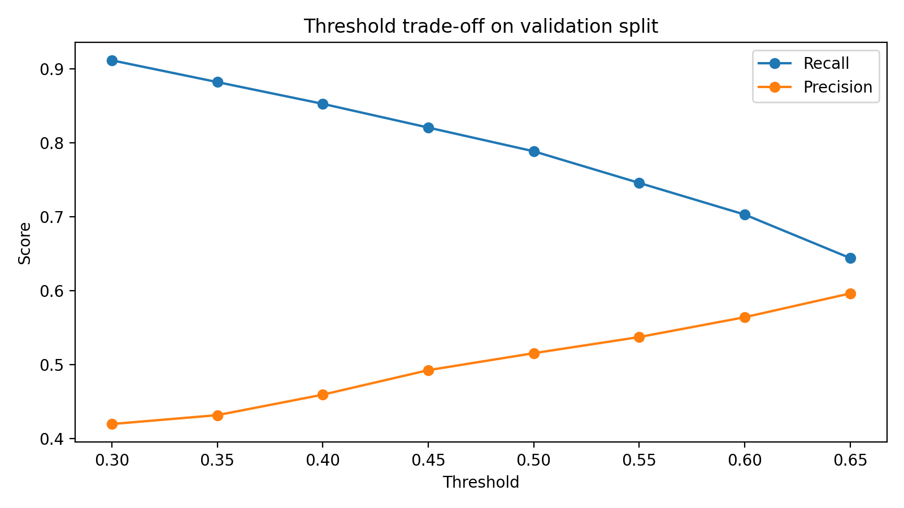
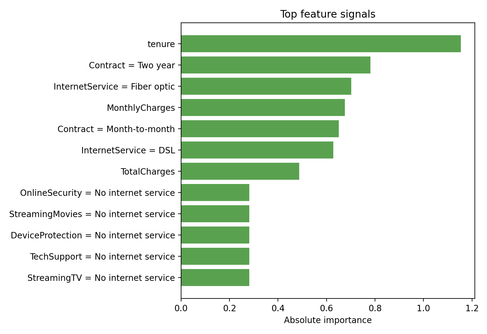

# customer-retention-ml-system

End-to-end machine learning project for predicting customer churn and turning model scores into retention actions.

## Project overview

This project uses the [Telco Customer Churn dataset](https://www.kaggle.com/datasets/blastchar/telco-customer-churn?resource=download) to answer a business question instead of stopping at pure classification:

> Which customers are most likely to churn, and how should a retention team act on those predictions?

The repository combines:

- exploratory analysis of churn patterns
- reproducible preprocessing and training pipelines
- model comparison across baseline and tree-based approaches
- threshold selection based on retention use case
- retention action recommendations with scenario-based expected value
- a Streamlit dashboard for interactive demos

## Dataset

Source: Kaggle Telco Customer Churn dataset

Dataset shape:

- 7,043 customer records
- 21 columns
- target column: `Churn`

Notable cleaning details:

- `TotalCharges` contains 11 blank values in the raw file and is converted to numeric
- `Churn` is encoded from `Yes`/`No` to `1`/`0`
- `customerID` is excluded from modeling

## Repository structure

```text
customer-retention-ml-system/
├── dashboard/
├── data/
│   ├── raw/
│   └── processed/
├── models/
│   └── artifacts/
├── notebooks/
├── reports/
│   └── figures/
├── src/
│   ├── business/
│   ├── data/
│   ├── features/
│   └── models/
└── tests/
```

## Modeling approach

Three models are trained and compared on a validation split:

- Logistic Regression
- Random Forest
- HistGradientBoostingClassifier

The final selected model is **Logistic Regression** because it delivered the strongest validation PR-AUC while remaining easy to interpret for business use.

The workflow uses:

- train / validation / test split with stratification
- preprocessing pipelines for numeric and categorical features
- PR-AUC, ROC-AUC, precision, recall, F1, and Brier score
- threshold tuning based on recall-sensitive retention targeting

## Final results

Selected model: `logistic_regression`

Selected threshold: `0.60`

Test split metrics:

- ROC-AUC: `0.8417`
- PR-AUC: `0.6327`
- Precision: `0.5399`
- Recall: `0.7059`
- F1 Score: `0.6118`

Validation comparison:

| Model | ROC-AUC | PR-AUC | Recall |
| --- | ---: | ---: | ---: |
| Logistic Regression | 0.8363 | 0.6424 | 0.7888 |
| Random Forest | 0.8375 | 0.6408 | 0.7433 |
| HistGradientBoosting | 0.8295 | 0.6355 | 0.5027 |

## Business insights

The data audit and feature importance outputs highlight a few strong churn patterns:

- Month-to-month contracts have much higher churn than one-year and two-year contracts
- Customers without tech support churn much more often than supported customers
- Electronic check payments are associated with the highest churn rate
- Fiber optic customers and shorter-tenure customers show elevated churn risk

Retention actions are mapped from predicted risk:

- high risk: discount plus proactive support outreach
- medium risk: personalized retention email
- low risk: monitor without extra spend

Expected value estimates are included as scenario-based assumptions, not real company savings claims.

## Visual outputs

### Model comparison



### Threshold trade-off



### Top feature signals



## Notebook and dashboard

- EDA and model review notebook: `notebooks/churn_eda_and_model_review.ipynb`
- Streamlit app: `dashboard/app.py`

The dashboard lets you:

- enter a customer profile
- score churn probability
- view the risk band
- see the recommended retention action
- inspect the main prediction drivers

## How to run locally

1. Create a virtual environment and install dependencies:

   ```bash
   python3 -m venv .venv
   . .venv/bin/activate
   pip install -r requirements.txt
   ```

2. Train the models and generate artifacts:

   ```bash
   python -m src.models.train
   ```

3. Run the tests:

   ```bash
   PYTHONPATH=. pytest -q
   ```

4. Launch the dashboard:

   ```bash
   PYTHONPATH=. streamlit run dashboard/app.py
   ```

## What I would improve next

- add calibration curves and probability calibration comparison
- test threshold policies under different business cost assumptions
- version model artifacts and metrics more formally
- add experiment tracking for hyperparameter tuning
- package the inference pipeline for deployment
